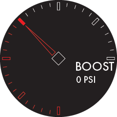

<p align="center">
  <a href="https://www.multi-gauge.com/">
    
  </a>
</p>

<h1 align="center">Multigauge</h1>

## About

`multigauge-esp32` is the ESP32 target for [`multigauge-core`](https://github.com/bluesqqq/multigauge-core).

## Quick Start

Get a gauge running in a few minutes.

### 1. Clone the repo
```bash
git clone https://github.com/bluesqqq/multigauge-esp32.git
cd multigauge-esp32
```
### 2. Install PlatformIO
Install PlatformIO (recommended via [VS Code extension](https://platformio.org/install/ide?install=vscode))

### 3. Connect your ESP32

### 4. Upload filesystem (required!)
```bash
platformio run -e esp32-s3-devkitc-1 -t uploadfs
```

### 5. Flash firmware
```bash
platformio run -e esp32-s3-devkitc-1 -t upload
```

### 6. Done!

You should now see the default gauge rendered on your display.

## Current Hardware Profile

> ⚠️ This configuration targets a specific ESP32-S3 + display setup.
> Other hardware will require changes to `LGFX_definition.h`.

The repo is currently configured for a specific ESP32-S3 display setup out of the box:

- Board: `esp32-s3-devkitc-1`
- Display driver: `GC9A01`
- Resolution: `240x240`
- Touch controller: `CST816S`
- Filesystem: `LittleFS`

The default pin mapping in [`src/platform/LGFX_definition.h`](./src/platform/LGFX_definition.h) is:

| Function | Pin |
| --- | --- |
| SPI SCLK | `10` |
| SPI MOSI | `11` |
| SPI MISO | `12` |
| Display D/C | `8` |
| Display CS | `9` |
| Display RST | `14` |
| Backlight | `2` |
| Touch INT | `5` |
| Touch SDA | `6` |
| Touch SCL | `7` |

If your board, display, or touch controller differs, this header is the main place to start adapting the target.

## Customizing

- Edit [`data/gauges/gauge.json`](./data/gauges/gauge.json) to change the gauge layout being rendered
- Adjust colors, vehicle settings, and preferred units in [`data/settings.json`](./data/settings.json)
- Update [`src/platform/LGFX_definition.h`](./src/platform/LGFX_definition.h) for different boards, displays, or touch controllers

There are also early sensor abstraction helpers in [`src/platform/`](./src/platform/) that can be used as a starting point for wiring live inputs into dashboard values. Support for various sensors will be added incrementally.

## Status

`multigauge-esp32` is actively under development.
